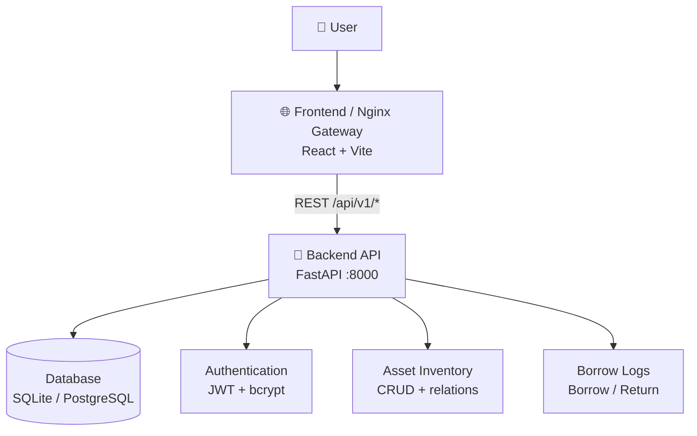

# ☁️ Cloud App — IT Asset Management System

> Aplikasi cloud-native untuk manajemen aset dan inventory IT, dibangun dengan FastAPI, React + Vite, Docker Compose, dan Nginx gateway sebagai proyek mata kuliah Komputasi Awan — Institut Teknologi Kalimantan.


## 🏗️ Architecture



### Architecture Evolution

| Phase | Weeks | Architecture |
|---|---:|---|
| Foundation | 1–4 | Monolith (FastAPI + React + SQLite) |
| Containerization | 5–7 | Docker Compose with separate backend and frontend services |
| CI/CD | 9–11 | GitHub Actions + Railway deployment |
| Gateway & Security | 12–14 | Nginx frontend serving, reverse proxy config, JWT auth, CORS |
| Final | 15–16 | Security hardened, rate limiting, input validation, formatter config, final docs |

## 🛠️ Tech Stack

| Layer | Technology | Purpose |
|---|---|---|
| Frontend | React + TypeScript + Vite | Single Page Application |
| Styling | Tailwind CSS + Radix UI | Responsive UI and accessible components |
| Package Manager | Bun | Frontend dependency management |
| Backend | FastAPI (Python 3.12+) | REST API service |
| Database | SQLite / PostgreSQL | Relational data storage |
| ORM | SQLAlchemy | Database access and migrations |
| Validation | Pydantic | Request/response schema validation |
| Auth | JWT + bcrypt | Token authentication and password hashing |
| Gateway | Nginx | Frontend serving and rate-limiting config |
| Container | Docker + Docker Compose | Reproducible local and production runtime |
| CI/CD | GitHub Actions + Railway | Automated test and deployment |

## 🚀 Quick Start

### Prerequisites

- Docker Desktop
- Docker Compose
- Python 3.12+
- Bun
- Git

### Run Locally with Docker Compose

```bash
# Clone repository
git clone https://github.com/aidilsaputrakirsan-classroom/cc-kelompok-a-nyawit.git
cd cc-kelompok-a-nyawit

# Copy environment example
cp .env.example .env
# Edit .env with your values

# Start all services
docker compose up -d --build

# Verify
docker compose ps
curl http://localhost/api/v1/health
```

Open http://localhost in your browser.

### Run Backend Without Docker

```bash
cd backend
python -m venv .venv
.\.venv\Scripts\activate# Windows
# source .venv/bin/activate# Linux/macOS

pip install -r requirements-prod.txt
uvicorn app.main:app --reload --host 0.0.0.0 --port 8000
```

Backend API: http://localhost:8000/api/v1
Swagger UI: http://localhost:8000/api/v1/docs

### Run Frontend Without Docker

```bash
cd frontend
bun install
bun dev
```

Frontend: http://localhost:5173

## 📡 API Documentation

Base API path: `/api/v1`

### Authentication

| Method | Endpoint | Description | Auth |
|---|---|---|---|
| POST | `/auth/register` | Register user baru | ❌ |
| POST | `/auth/login` | Login, returns JWT token | ❌ |
| GET | `/auth/me` | Current authenticated user | ✅ |

### Users

| Method | Endpoint | Description | Auth |
|---|---|---|---|
| GET | `/users` | List users | Manager/Admin |
| GET | `/users/{id}` | Get user with created assets | Manager/Admin |
| POST | `/users` | Create user | Manager/Admin |
| PUT | `/users/{id}` | Update user | Manager/Admin |
| DELETE | `/users/{id}` | Delete user | Manager/Admin |

### Assets

| Method | Endpoint | Description | Auth |
|---|---|---|---|
| GET | `/assets` | List assets, optional `status` and `category_id` filters | ❌ |
| POST | `/assets` | Create asset | ✅ |
| GET | `/assets/{id}` | Get asset by ID | ❌ |
| PUT | `/assets/{id}` | Update asset | ✅ |
| DELETE | `/assets/{id}` | Delete asset | ✅ |

### Categories

| Method | Endpoint | Description | Auth |
|---|---|---|---|
| GET | `/categories` | List categories | ❌ |
| POST | `/categories` | Create category | ✅ |
| GET | `/categories/{id}` | Get category | ❌ |
| PUT | `/categories/{id}` | Update category | ✅ |
| DELETE | `/categories/{id}` | Delete category | ✅ |

### Locations

| Method | Endpoint | Description | Auth |
|---|---|---|---|
| GET | `/locations` | List locations with asset count | ❌ |
| POST | `/locations` | Create location | ✅ |
| GET | `/locations/{id}` | Get location with asset count | ❌ |
| PUT | `/locations/{id}` | Update location | ✅ |
| DELETE | `/locations/{id}` | Delete location | ✅ |

### Asset Types

| Method | Endpoint | Description | Auth |
|---|---|---|---|
| GET | `/asset-types` | List asset types | ❌ |
| POST | `/asset-types` | Create asset type | ✅ |
| PUT | `/asset-types/{id}` | Update asset type | ✅ |
| DELETE | `/asset-types/{id}` | Delete asset type | ✅ |

### Borrow Logs

| Method | Endpoint | Description | Auth |
|---|---|---|---|
| POST | `/borrow-logs` | Borrow asset | Manager/Admin |
| POST | `/borrow-logs/{id}/return` | Return borrowed asset | Manager/Admin |
| GET | `/borrow-logs` | List borrow logs | ✅ |
| GET | `/borrow-logs/asset/{asset_id}` | List borrow logs by asset | ✅ |

### Transactions

| Method | Endpoint | Description | Auth |
|---|---|---|---|
| GET | `/transactions` | List transactions | ✅ |
| POST | `/transactions` | Create transaction | ✅ |
| GET | `/transactions/{id}` | Get transaction | ✅ |
| PUT | `/transactions/{id}` | Update transaction | ✅ |
| DELETE | `/transactions/{id}` | Delete transaction | ✅ |

### Conditions

| Method | Endpoint | Description | Auth |
|---|---|---|---|
| GET | `/conditions` | List condition summaries with asset counts | ✅ |
| GET | `/conditions/{condition_name}` | Get assets by condition | ✅ |
| PUT | `/conditions/{condition_name}/update-description` | Update condition description | ✅ |

### Health

| Method | Endpoint | Description | Auth |
|---|---|---|---|
| GET | `/api/v1/health` | Backend health check | ❌ |

### Via Gateway / Port 80

Production frontend is served on port 80. API calls use the configured backend origin. The gateway config in `backend/nginx.conf` includes rate limiting for:

- `auth_limit`: 5 requests/second for login/register
- `api_limit`: 20 requests/second for API routes
- `general_limit`: 30 requests/second for general routes and frontend

## 🔐 Security

- JWT authentication with expiry
- bcrypt password hashing
- Rate limiting in Nginx gateway config
- Pydantic input validation for request bodies
- CORS configured with `ALLOW_ORIGINS`
- Secrets loaded from environment variables
- Production `SECRET_KEY` validation
- Role-based access control for admin and manager operations

## 📊 Monitoring & Operations

- Docker healthcheck for backend API
- `/api/v1/health` endpoint for runtime health checks
- Structured application logs through Python logging
- Nginx gateway config includes rate-limiting and JSON 429 response
- Railway production deployment uses environment variables and managed PostgreSQL

## 👥 Tim

| Nama | NIM | Peran | Kontribusi Utama |
|---|---:|---|---|
| Ilham Ahmad Fahriji | 10231042 | Lead Backend & Lead DevOps | Backend API, JWT auth, database, Docker, Nginx gateway, deployment |
| Putu Ngurah Semara | 10231075 | Lead Frontend & Lead QA & Docs | React UI, API integration, dashboard, testing, documentation |

## 📄 Documentation

- [Deployment Guide](docs/deployment-guide.md)
- [API Contract](docs/api-contract.md)
- [Release Notes Milestone 3](docs/release-notes-m3.md)
- [UAS Presentation Outline](docs/uas-presentation-outline.md)

## 📅 Roadmap

| Week | Target | Status |
|---:|---|---|
| 1 | Setup & Hello World | ✅ |
| 2 | REST API + Database | ✅ |
| 3 | React Frontend | ✅ |
| 4 | Full-Stack Integration + Auth | ✅ |
| 5–7 | Docker & Compose | ✅ |
| 8 | UTS Demo (Milestone 1) | ✅ |
| 9–11 | CI/CD & Cloud Deployment | ✅ |
| 12–14 | Gateway, monitoring, and operational hardening | ✅ |
| 15 | Final Polish & Security | ✅ |
| 16 | UAS Demo (Milestone 3) | ⬜ |

## 🧪 Default Users

After database seeding, use these development users:

| Role | Username | Password |
|---|---|---|
| Admin | `admin` | `admin123` |
| IT Staff | `it` | `it123` |
| Tech Support | `tech` | `tech123` |

Change default passwords before production use.

## 🧹 Code Quality

Backend formatter configuration is available in `backend/pyproject.toml`:

```toml
[tool.black]
line-length = 88
target-version = ["py312"]

[tool.isort]
profile = "black"
line_length = 88
```

Frontend formatter configuration is available in `frontend/.prettierrc.json`.

## 📦 Project Structure

```text
cc-kelompok-a-nyawit/
├── backend/# FastAPI backend
│ ├── app/
│ │ ├── api/
│ │ ├── core/
│ │ ├── db/
│ │ ├── models/
│ │ └── schemas/
│ ├── nginx.conf# Gateway/rate-limiting config
│ ├── pyproject.toml# Python formatter config
│ └── Dockerfile
├── frontend/ # React + Vite frontend
│ ├── pages/
│ ├── components/
│ ├── hooks/
│ ├── lib/
│ ├── nginx.conf.template
│ └── Dockerfile
├── docs/ # Deployment, API, release, and presentation docs
├── docker-compose.yml
├── docker-compose.prod.yml
└── README.md
```

## 📝 Production Notes

- Use a strong `SECRET_KEY` in production.
- Use Railway PostgreSQL or another managed PostgreSQL service for production.
- Set `ALLOW_ORIGINS` to trusted frontend domains only.
- Do not use `uvicorn --reload` in production.
- Review `backend/nginx.conf` before deploying Nginx as the public gateway.
