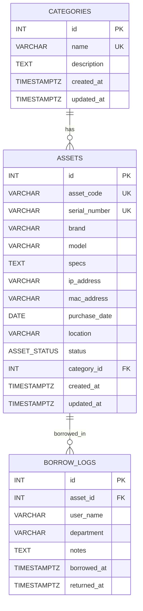

# Database ERD (Mermaid)

Di bawah ini adalah diagram tabel dari `schema.sql`.



## Export jadi gambar (PNG/SVG)

Jalankan dari folder `backend/database`:

```bash
npx -y @mermaid-js/mermaid-cli -i erd.mmd -o erd.svg
npx -y @mermaid-js/mermaid-cli -i erd.mmd -o erd.png
```

Hasil file gambar:

- `backend/database/erd.svg`
- `backend/database/erd.png`
