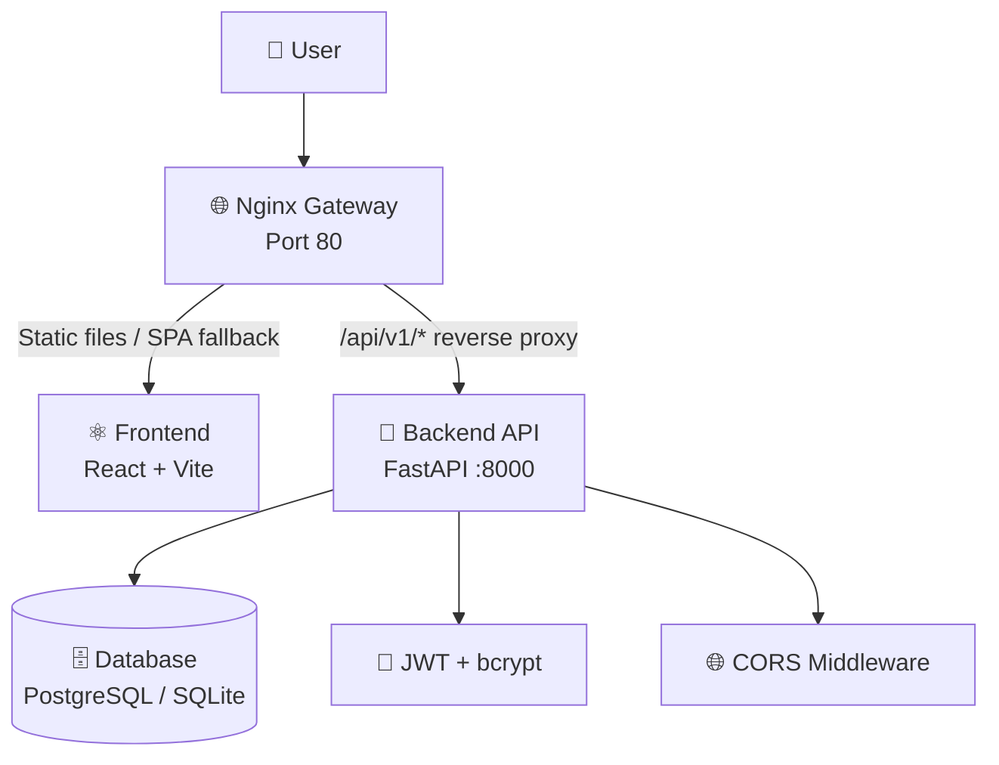
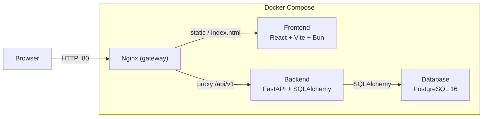

# UAS Presentation Outline — Cloud App IT Asset Management System

> Dokumen ini adalah outline presentasi UAS lengkap. Setiap slide disertai penjelasan teknis yang bisa langsung disampaikan, termasuk peran **FastAPI, JWT, CORS, Nginx reverse proxy, Docker Compose, CI/CD**, dan komponen lainnya.

---

## Slide 1: Title

- **Nama proyek:** Cloud App — IT Asset Management System
- **Nama tim:** Kelompok A (Nyawit)
- **Anggota:**
  - Ilham Ahmad Fahriji — 10231042
  - Putu Ngurah Semara — 10231075
- **Mata kuliah:** Komputasi Awan — Institut Teknologi Kalimantan
- **Repository:** `aidilsaputrakirsan-classroom/cc-kelompok-a-nyawit`
- **Badges:**
  - 
  - 

**Catatan pembicara:**
> “Kami membangun sistem manajemen aset IT berbasis cloud. Aplikasi ini memungkinkan tim IT mencatat, memantau, meminjamkan, dan memindahkan aset IT secara terpusat dengan autentikasi dan deployment yang siap produksi.”

---

## Slide 2: Problem & Solution

### Masalah yang diselesaikan
1. Banyak unit IT masih mencatat aset dengan spreadsheet → data tidak konsisten dan sulit dicari.
2. Tidak ada jejak audit (siapa yang meminjam/mengembalikan aset, kapan aset dipindahkan).
3. Tidak ada kontrol akses berbasis peran (admin, manager, staff).
4. Sulit mengetahui kondisi dan lokasi aset secara real-time.

### Target pengguna
- Admin IT / Manager IT
- Staff teknis dan helpdesk
- Institusi pendidikan, kantor pemerintahan, atau UKM yang memiliki banyak aset IT

### Solusi
- **Sistem manajemen aset IT berbasis web** dengan fitur:
  - CRUD aset, kategori, lokasi, dan tipe aset
  - Peminjaman dan pengembalian aset (*borrow/return logs*)
  - Pemindahan aset antar lokasi (*transactions*)
  - Autentikasi JWT dan kontrol akses berbasis peran
  - Dashboard dan status kondisi aset
  - Deployment cloud dengan Docker + Railway

**Catatan pembicara:**
> “Aplikasi kami menggantikan pencatatan manual dengan database terpusat. Setiap perubahan status aset tercatat, sehingga audit menjadi lebih mudah.”

---

## Slide 3: Architecture Journey

### Evolusi arsitektur

| Fase | Minggu | Arsitektur |
|---|---|---|
| Foundation | 1–4 | Monolith: FastAPI backend + React frontend + SQLite dalam satu repo |
| Containerization | 5–7 | Docker Compose: backend, frontend, dan database terpisah |
| CI/CD | 9–11 | GitHub Actions (test & build) + Railway deployment |
| Gateway & Security | 12–14 | Nginx reverse proxy, JWT auth, CORS, rate limiting |
| Final | 15–16 | Security hardening, input validation, formatter config, dokumentasi lengkap |

### Diagram arsitektur final



**Catatan pembicara:**
> “Kami memulai dari monolith sederhana, lalu memisahkan layanan dengan Docker Compose. Di fase akhir, kami menambahkan Nginx sebagai gerbang utama sehingga pengguna hanya mengakses port 80, sementara backend tetap aman di belakang proxy.”

---

## Slide 4: Tech Stack & Infrastructure

### Diagram arsitektur final (versi layanan)



### Jumlah containers, services, dan endpoints

- **Containers/services:** 3 utama (database, backend, frontend). Nginx berjalan di dalam container frontend sebagai gateway.
- **Backend endpoints:** sekitar 30+ endpoint di bawah prefix `/api/v1`, mencakup:
  - Authentication: `/auth/register`, `/auth/login`, `/auth/me`
  - Users, Assets, Categories, Locations, Asset Types
  - Borrow Logs, Transactions, Conditions
  - Health: `/api/v1/health`

### Penjelasan teknologi utama

#### 1. FastAPI
- Framework Python modern berbasis *type hints* dan *async*.
- Otomatis menghasilkan dokumentasi interaktif di `/docs` (Swagger UI) dan `/redoc`.
- Menggunakan **Pydantic** untuk validasi request/response schema.
- Dependency injection memudahkan penggunaan database session dan autentikasi.

#### 2. JWT (JSON Web Token)
- Token diterbitkan saat login dengan algoritma **HS256**.
- Payload berisi `sub` (username/user id), `role`, dan `exp` (expiry, default 30 menit).
- Client menyimpan token dan mengirimkannya di header:
  ```http
  Authorization: Bearer <token>
  ```
- Backend memverifikasi token di setiap *protected route*.
- Password di-hash dengan **bcrypt** sebelum disimpan ke database.

#### 3. CORS (Cross-Origin Resource Sharing)
- Diatur di `backend/app/main.py` menggunakan `CORSMiddleware` dari FastAPI.
- Origin yang diizinkan diambil dari environment variable `ALLOW_ORIGINS` (comma-separated).
- Contoh lokal: `http://localhost`
- Contoh produksi: `https://manajemenaset.up.railway.app`
- **Tidak menggunakan `*` di produksi** demi keamanan.

#### 4. Nginx Reverse Proxy
- Berjalan di port 80 sebagai pintu masuk tunggal.
- **Reverse proxy:** meneruskan request `/api/v1/*` dan `/docs` ke backend di port 8000.
- **Static file serving:** melayani file hasil build React (JS, CSS, gambar).
- **SPA fallback:** request non-API/non-static dikembalikan ke `index.html` agar routing React client-side berfungsi saat refresh.
- **Rate limiting:** membatasi jumlah request untuk mencegah brute-force dan abuse:
  - `auth_limit`: 5 req/s untuk login/register
  - `api_limit`: 20 req/s untuk API umum
  - `general_limit`: 30 req/s untuk frontend dan static

#### 5. Docker Compose
- Menyatukan backend, frontend, dan database dalam satu stack.
- `docker-compose.yml` untuk lokal development (PostgreSQL + healthcheck).
- `docker-compose.prod.yml` untuk deployment produksi.
- Environment variables terpusat: `SECRET_KEY`, `DATABASE_URL`, `ALLOW_ORIGINS`, `FRONTEND_API_BASE_URL`.

#### 6. CI/CD Pipeline (GitHub Actions)

**CI (`ci.yml`)** — berjalan di push/PR ke `main`, `master`, `develop`:
1. **Backend Tests:** install dependencies, jalankan pytest dengan coverage.
2. **Frontend Build:** install dengan Bun, jalankan `bun run build`.
3. **Frontend Tests:** jalankan unit test.
4. **Docker Build:** build image backend dan frontend tanpa push.

**CD (`cd.yml`)** — berjalan saat push ke `main`/`master`:
1. Login ke GitHub Container Registry (GHCR).
2. Build dan push image backend & frontend ke `ghcr.io/<repository>/backend:latest` dan `frontend:latest`.
3. Railway dapat melakukan auto-deploy dari image/registry atau langsung dari repository.

#### 7. Monitoring & Observability
- **Health check:** endpoint `GET /api/v1/health` mengembalikan `{ "status": "healthy" }`.
- **Docker healthcheck:** container backend diperiksa setiap 30 detik.
- **Structured logs:** aplikasi FastAPI mencatat event startup, request, dan error.
- **Rate-limit response:** Nginx mengembalikan JSON 429 saat limit tercapai.

**Catatan pembicara:**
> “FastAPI kami dipilih karena cepat, mudah divalidasi dengan Pydantic, dan punya Swagger UI bawaan. Keamanan diperkuat dengan JWT, bcrypt, CORS, dan rate limiting di Nginx. Semuanya diotomatisasi dengan GitHub Actions dan dideploy ke Railway.”

---

## Slide 5: Live Demo

### Alur demo

1. Buka aplikasi di `http://localhost` (atau URL produksi cadangan).
2. Register user baru (validasi password minimal 8 karakter, huruf besar, dan angka).
3. Login → sistem mengembalikan JWT access token.
4. Buat 2–3 aset IT (misal: laptop, monitor, printer).
5. Tampilkan daftar aset.
6. Update salah satu aset (ubah lokasi atau kondisi).
7. Hapus aset.
8. Buka halaman `/status` atau hit `/api/v1/health` → tampilkan status `healthy`.
9. Tunjukkan badge CI/CD hijau di GitHub Actions.
10. Tampilkan log terstruktur dengan `docker compose logs -f backend`.

### Backup
- Jika internet bermasalah, gunakan **rekaman video demo lokal** atau jalankan `docker compose up -d --build` di laptop presentasi.

### URL yang digunakan saat demo

| Lingkungan | URL |
|---|---|
| Lokal (via Nginx) | `http://localhost` |
| Backend langsung | `http://localhost:8000/api/v1` |
| Swagger UI lokal | `http://localhost:8000/api/v1/docs` |
| Produksi backend | `https://backend-production-1fe2.up.railway.app/api/v1` |
| Produksi frontend | `https://manajemenaset.up.railway.app` |

**Catatan pembicara:**
> “Demo kami mengikuti alur pengguna nyata: register, login, lalu mengelola aset. Token JWT akan terlihat di network tab browser saat login. Setiap operasi tercatat dan bisa diverifikasi lewat health check serta log.”

---

## Slide 6: Challenges & Lessons Learned

| Challenge | Solusi |
|---|---|
| **CORS error saat frontend produksi mengakses backend** | Mengatur `ALLOW_ORIGINS` via environment variable dan menggunakan `CORSMiddleware` FastAPI. Di produksi origin dibatasi ke domain frontend, tidak menggunakan wildcard `*`. |
| **Race condition backend vs database saat container startup** | Menambahkan `depends_on` + `healthcheck` di Docker Compose, serta retry loop di event `startup` FastAPI (5 kali percobaan dengan interval 5 detik). |
| **Nginx reverse proxy dan SPA fallback** | Memisahkan `location /api/` untuk proxy ke backend dan `location /` dengan `try_files $uri $uri/ /index.html` agar routing React tidak 404 saat refresh. |
| **Rate limiting brute-force di auth** | Membuat zone `auth_limit` khusus untuk `/auth/login` dan `/auth/register` dengan batas 5 request per detik. |

### Biggest learning
- **Infrastructure as Code dan environment-based configuration sangat penting:** menyimpan konfigurasi di `.env` dan Docker Compose membuat aplikasi mudah dijalankan di lokal maupun produksi tanpa mengubah kode.
- **Pemisahan tanggung jawab (separation of concerns):** frontend hanya UI, backend hanya API, Nginx hanya gateway, database hanya penyimpanan. Ini memudahkan pemeliharaan dan skalabilitas.
- **Keamanan tidak boleh dilupakan di akhir:** autentikasi, otorisasi, validasi input, CORS, dan rate limiting harus dirancang sejak awal.

---

## Slide 7: Team Contributions

| Nama | NIM | Role | Kontribusi Utama | Komitmen |
|---|---|---|---|---|
| Ilham Ahmad Fahriji | 10231042 | Lead Backend & Lead DevOps | Backend API FastAPI, JWT auth, model database, Docker Compose, Nginx gateway, deployment Railway | ~42 commits |
| Putu Ngurah Semara | 10231075 | Lead Frontend & Lead QA & Docs | React UI, integrasi API, dashboard, testing, dokumentasi (README, API contract, deployment guide) | ~33 commits |

> Jumlah commit dihitung dari `git shortlog` dan dapat berubah; detail lengkap ada di GitHub Insights.

---

## Demo Script (urutan langkah detail)

1. **Buka aplikasi**
   ```bash
   open http://localhost
   # atau
   curl http://localhost/api/v1/health
   ```

2. **Register user baru**
   - Klik menu Register.
   - Isi username, email, full name, password (`StrongPass123`).
   - Jelaskan validasi Pydantic di backend.

3. **Login**
   - Masukkan username dan password.
   - Perlihatkan response JWT di browser DevTools → Network.
   - Jelaskan token disimpan dan dikirim sebagai `Authorization: Bearer <token>`.

4. **Create 2–3 items (aset)**
   - Navigasi ke menu Assets → Add Asset.
   - Buat contoh: Laptop MacBook Pro, Monitor Dell 24", Printer HP.

5. **Show item list**
   - Tampilkan daftar aset dan filter berdasarkan status/kategori.

6. **Update item**
   - Pilih satu aset, ubah lokasi atau kondisi, simpan.

7. **Delete item**
   - Hapus salah satu aset, konfirmasi list berkurang.

8. **Buka halaman status / health**
   ```bash
   curl http://localhost/api/v1/health
   ```
   - Harus muncul `{ "status": "healthy" }`.

9. **Show GitHub Actions CI/CD badge green**
   - Buka repository di GitHub.
   - Tunjukkan workflows `ci.yml` dan `cd.yml` berstatus hijau.

10. **Show structured logs**
    ```bash
    docker compose logs -f backend
    ```
    - Perlihatkan log startup, request, dan health check.

---

## Appendix: Penjelasan Teknologi dalam Satu Halaman

### FastAPI
Backend framework Python yang cepat, modern, dan berbasis *type hints*. Mendukung validasi otomatis via Pydantic dan dokumentasi interaktif Swagger UI.

### Pydantic
Library validasi data di Python. Digunakan untuk memastikan request body sesuai schema (misal: password memiliki huruf besar dan angka, email valid, integer positif).

### SQLAlchemy
ORM (Object-Relational Mapping) untuk Python. Mempermudah operasi database tanpa menulis SQL manual dan mendukung migrasi.

### JWT (JSON Web Token)
Token bertanda tangan digital yang berisi identitas dan peran user. Dipakai untuk autentikasi stateless: server tidak perlu menyimpan session, cukup memverifikasi token.

### bcrypt
Algoritma hashing password. Password asli tidak pernah disimpan; yang disimpan adalah hash sehingga aman jika database bocor.

### CORS
Kebijakan browser yang membatasi request dari origin lain. FastAPI kami mengizinkan origin tertentu saja melalui `ALLOW_ORIGINS`.

### Nginx Reverse Proxy
Nginx menerima request dari user di port 80, lalu meneruskannya ke backend (port 8000). Sehingga user tidak perlu mengakses backend langsung.

### Nginx Rate Limiting
Membatasi jumlah request per IP untuk mencegah brute-force login, spam register, dan abuse API.

### Docker Compose
Mendefinisikan multi-container stack dalam satu file YAML. Memudahkan menjalankan backend, frontend, dan database sekaligus.

### GitHub Actions
Layanan CI/CD dari GitHub. `ci.yml` menjalankan test dan build setiap push/PR. `cd.yml` build dan push image ke GHCR saat push ke main.

### Railway
Platform cloud deployment yang terintegrasi dengan GitHub. Aplikasi kami dideploy otomatis dari repository/image.

### Health Check
Endpoint `/api/v1/health` memberi sinyal apakah backend dan database siap melayani request. Digunakan Docker dan monitoring.

---

## Link Dokumentasi Pendukung

- [Deployment Guide](deployment-guide.md)
- [API Contract](api-contract.md)
- [Release Notes Milestone 3](release-notes-m3.md)
- [README utama](../README.md)
